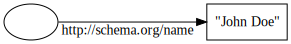
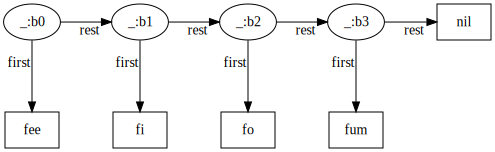

# Addressing

[Blank nodes](https://www.w3.org/TR/rdf11-concepts/#section-blank-nodes) in RDF are a blessing and a curse. They're anonymous nodes that don't have any semantic identifier. In practice most serializations end up needing locally-scoped labels to actually represent them, although in JSON-LD, every JSON object that doesn't have an explicit `"@id"` property is implicitly interpreted as a new, distinct blank node. So the JSON-LD document

```json
{
	"http://schema.org/name": "John Doe"
}
```

is equivalent to the N-Triples file

```n-quads
_:foo <http://schema.org/name> "John Doe" .
```

in encoding the graph



The `_:foo` label only exists to distinguish it from other blank nodes in the same dataset - it has no global significance.

Blank nodes are useful for representing data structures that don't fit into a graph model well, like linked lists, where the elements must be ordered:

```n-quads
_:b0 <http://www.w3.org/1999/02/22-rdf-syntax-ns#first> "fee" .
_:b0 <http://www.w3.org/1999/02/22-rdf-syntax-ns#rest> _:b1 .
_:b1 <http://www.w3.org/1999/02/22-rdf-syntax-ns#first> "fi" .
_:b1 <http://www.w3.org/1999/02/22-rdf-syntax-ns#rest> _:b2 .
_:b2 <http://www.w3.org/1999/02/22-rdf-syntax-ns#first> "fo" .
_:b2 <http://www.w3.org/1999/02/22-rdf-syntax-ns#rest> _:b3 .
_:b3 <http://www.w3.org/1999/02/22-rdf-syntax-ns#first> "fum" .
_:b3 <http://www.w3.org/1999/02/22-rdf-syntax-ns#rest> <http://www.w3.org/1999/02/22-rdf-syntax-ns#nil> .
```



We don't want to come up with URIs for every link in our linked list, so we use blank nodes to structure our data without them.

---

But sometimes we _want_ URIs for blank nodes - even though they were invented to avoid that! In particular, since Styx stores data from many datasets all together, it needs a way of internally representing their blank nodes in a way that keeps them all distinct. And more importantly, Styx will sometimes find blank nodes from datasets that satisfy variables in queries, and it needs to return a ground value to the user that identifies

(and for that matter: how do we identitfy datasets?)

The RDF spec has a [section on "skolemization"](https://www.w3.org/TR/rdf11-concepts/#section-skolemization), which is what they call the process of replacing blank nodes with globally-unique URIs, and it prescribes minting [well-known URIs](https://www.rfc-editor.org/rfc/rfc5785.txt) for blank nodes intended to be shared.

```
http://example.com/.well-known/genid/d26a2d0e98334696f4ad70a677abc1f6
```

This strategy is unsatisfying because it assumes that the user has ownership and authority over a domain name. This is a huge assumption and it betrays

`ul:bafybeihtwwo4oxd5wu7qlrsn5orm7juonw3xmk6sprkl4o5ewx3s7feg5y#_:c14n0`

Styx is intented to be a store of arbitrary RDF data: you should be able to toss any valid RDF dataset into it and usefully retrieve its contents.

Other times we use blank nodes to

One point of complexity is the handling of blank nodes. If a variable in a pattern matches a blank node from some dataset, how do we reference the blank node in the result? We can't just We need some way of grounding blank nodes, preferably in a way that maximizes context.

One approach is to

Styx: a graph store for the decentralized semantic web

Since RDF datasets can contain blank nodes, and they might turn up in query results, so we need some way of referring to them

And internally, we need some way of storing them such that two blank nodes from different datasets but with the same label don't collide and cause problems.

(hopefully canonical!) of referring to:

- datasets
- graphs within datasets
- statements within graphs
- blank nodes within statements!

This information is analogous to the information embedded in URIs themselves - protocol, origin, pathname, etc - and can be used as semantic cues in the same way. This point is worth elaborating: for better or worse, URIs in RDF are never opaque identifiers, and inevitably get inspected for hints about their referent.

The last three of these can be derived from the first using fragment identifiers.

One approach would be to make the user associate a URI with every dataset they insert, and then use fragment identifers to index into that dataset.

For example, suppose that a

The first could make the user associate a URI with every dataset they insert - that way we'd be able to

(in general, we want our graphs to say exactly what we mean, without incurring extraneous semantics)

It's important to stress that blank nodes are semantically scoped to the dataset - in many ways, they're defined constructively by their usage within it, and then sealed away.
