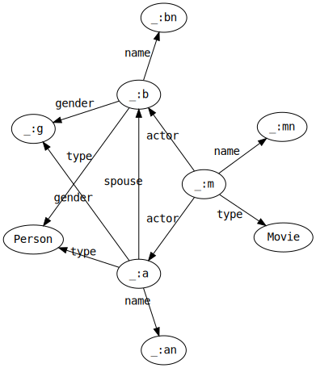
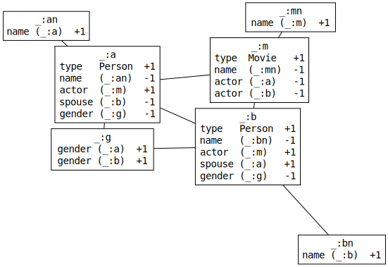

# Querying

When Styx first receives a subgraph query, it's in the form of a directed labeled multigraph, where some of the labels (of nodes _or_ edges) are variables (denoted throughout with a `_:` prefix).



This "star" shape is a common pattern: many real-world queries resemble a cluster of central nodes with several properties relating them all together, surrounded by a fringe of leaf variables that retrieve single properties of the central nodes. In this case, the query represents a same-sex married couple who both acted in the same film.

## Constraint Degree

Styx imposes two requirements on query graphs: every triple must have at least one blank node, and no triple can be all blank nodes. This _does_ mean that blank nodes can appear as predicates, which places the domain of "valid graphs" in-between regular RDF Graphs and [Generalized RDF Graphs](https://www.w3.org/TR/rdf11-concepts/#section-generalized-rdf). Both of these constraints may be relaxed in the future, but for now it just means making sure you "ground" at least one term in every triple.

This leaves exactly two cases for each triple: either it references one blank node, or it references two - although it's worth subdividing this into a third case: triples that reference the same blank node twice. These cases are called "degrees":

- 1st Degree triples reference exactly one blank node, like `_:a <rdf:type> <schema:Person> .`
- 2nd Degree triples reference two distinct blank nodes, like `_:a <schema:knows> _:b .`
- Z-Degree triples reference the same blank node twice, like `_:a <schema:funder> _:a .`

Note that even though two variables might be distinct in a query, they may resolve to the same value. This is why the popular term ["subgraph isomorphism"](https://en.wikipedia.org/wiki/Subgraph_isomorphism_problem) is avoided here: strictly speaking, subgraph matching is only subgraph _homomorphism_.

Given this categorization, notice that every degree (and therefore every triple) avails the following operations:

- Computing a ceiling of the number of distinct assignments to its variables that are possible in the database
  - For 1st-degree triples, this means rotating the variable into the last position, and looking up the concatenation of the first two positions in the Major table. For example, for the triple `_:a <rdf:type> <schema:Person> .`, the value of the key `'j' | id(rdf:type) | id(schema:Person)` is a uint64 counting how many distinct entries in the Triple table begin with `'b' | id(rdf:type) | id(schema:Person)`.
  - For 2nd- and Z-degree triples, this means taking the single ground (non-blank) term in the triple, retrieving its Index struct from the Index map, and looking up the appropriate position's count (total counts for each position are stored with each term's ID in the Index table).
- Generating a stream of deterministicly-ordered values for a given "target" variable
  - For 1st-degree triples, this means selecting the Triple table that rotates the single variable into the last position, and seeking to the first key that begins with the two ground values (in the appropriate order).
  - For 2nd-degree triples, this means selecting the Major or Minor table that places the position of the ground term first and the target variable second, and seeking to the first key that begins with the id of the ground value.
  - For Z-degree triples, since a variable is repeated, the selection of a Major or Minor table is arbitrary: there is exactly one of each that would work equally well. The process is otherwise the same as the 2nd degree.

At the beginning of query processing, every triple in a query graph is converted into a `Constraint` struct that captures all of the state so far described. In the case of 2nd-degree triples, _two_ Constraint structs are assembled: one from each "persective", each also holding a pointer to the other. The constraints for each _variable_ get collected into a `map[string]*Variable`, where each Variable contains a set of first-degree constraints `[]*Constraint`, a set of z-degree constraints `[]*Constraint`, and a map of second-degree constraints `map[string][]*Constraint` indexed by the label of the other variable.

```golang
// Variable is a collection of constraints on a particular blank node.
type Variable struct {
  CS    ConstraintSet
  DZ    ConstraintSet // (almost-always empty) constraints that reference the same variable twice, and one constant
  D1    ConstraintSet // constraints that reference the variable once, and two constants
  D2    ConstraintMap // constraints that reference the variable once, a different variable once, and one constant
  Value []byte        // The current assignment
  Root  []byte        // the first possible value for the variable, without joining on other variables
  Size  int           // The total number of constraints
  Norm  uint64        // The sum of squares of key counts of constraints
}

type ConstraintSet []*Constraint
type ConstraintMap map[string]ConstraintSet

type Constraint struct {
  Index    int    // The index of the triple within the dataset
  Place    uint8  // The term (subject = 0, predicate = 1, object = 2) within the triple
  M        HasID  // The next ((Place + 1) % 3) element in the triple
  m        []byte // a convience slot for the []byte of M, if it is known at the time
  N        HasID  // The previous ((Place + 2) % 3) element in the triple
  n        []byte // a convience slot for the []byte of N, if it is known at the time
  Count    uint64 // The number of triples that satisfy the Constraint
  Prefix   []byte // This is m and n (if it exists) appended to the appropriate prefix
  Iterator *badger.Iterator
  Dual     *Constraint // If (M or N) is a blank node, this is a pointer to their dual struct
}

// HasID is either a string representing a variable reference,
// or an Index representing an absolute value from the database
type HasID interface {
  GetID(param interface{}) uint64
}
```

## Constraint Graph

Conceptually, this is all a rearrangment from a directed pattern graph to an _undirected constraint graph_.



Here, all constraints have been grouped together under their respective variables, which now form the nodes of the graph. Previously the nodes were RDF _terms_, including ground IRIs and literals, but now they are conceptual sets of _independent constraints_. The edges between the variables now represent _mutual constraint_ - the presence of at least one triple referencing both variables. The undirectness of this constraint graph is important: all of the tables Styx keeps lets it index triples in any direction, which means that this constraint graph can be solved in any order. Either value of a 2nd-degree constraint can be propagated to the other, upgrading the dual 2nd-degree constraint to a virutal 1st-degree constraint in the process.

A key concept here is that the value generators of each constraint (the lines in each box) compose to make a value generator for the variable (the entire box), and that variable value generation is relatively fast. This is because each constraint has a `Seek(v []byte) []byte` operation that can be chained in series to efficiently enumerate the n-ary sort-merge join over all the constraints.

```golang
// Seek to the next intersection
func (cs ConstraintSet) Seek(v []byte) []byte {
  var count int
  l := cs.Len()
  for i := 0; count < l; i = (i + 1) % l {
    c := cs[i]
    next := c.Seek(v)
    if next == nil {
      return nil
    } else if bytes.Equal(next, v) {
      count++
    } else {
      count = 1
      v = next
    }
  }
  return v
}
```

### Sort heuristic

The high-level strategy from this point is to sort the variables into a linear order, and then incrementally seek to the first universally-satisfying set of assignments, backtracking when necessary. In pseudocode, this looks like:

```
sort the variables into a list
for every variable:
  value := variable.seek(nil)
  if value is nil:
    return
  else:
    variable.root = value
    variable.modified = false
index := 0
while index < len(variables):
  if variable.modified:
    variable.value = variable.seek(variable.root)
  else:
    variable.value = variable.root
  for every 2nd-degree constraint:

```

Sorting the constraint graph into linear order means selecting a heuristic
