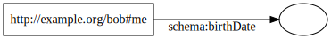
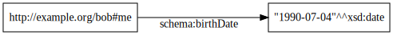
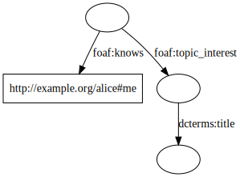
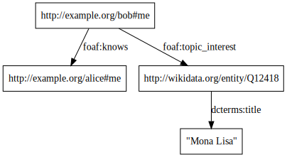
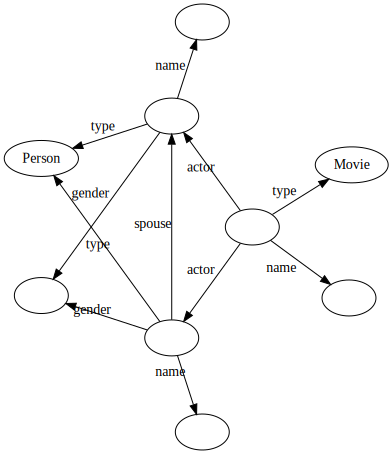

Welcome! Things are a mess.

Styx is a _graph store_, a new term coined to split the difference between a triplestore and a graph database. The basic concepts are covered on this page, and the internals are described in more detail in other pages:

- [USAGE](USAGE.md) describes the process of building, deploying, and reading and writing data
- [ADDRESSING](ADDRESSING.md) describes how Styx handles blank nodes and graph names in datasets through content-addressing
- [TABLES](TABLES.md) describes the internal data layout
- [QUERYING](QUERYING.md) describes the query processing algorithm

A basic understanding of RDF is assumed, which can be gathered from the [RDF Primer](https://www.w3.org/TR/rdf11-primer/).

## Data Model

The atomic unit of data that Styx stores is an _RDF Dataset_.

This is unusual! Although datasets can technically be as small as a single triple, Styx doesn't conceptually let you add or delete individual "edges" or "nodes" like other graph databases. Instead it's more like a set of documents: the data within those documents gets merged into the database and treated as one big soup during querying, but the only way to delete data is by removing a whole document at a time.

## Subgraph Matching

Styx can be understood as the graph data analog of a [key/value store](https://en.wikipedia.org/wiki/Key-value_database), where the keys are RDF graphs and the values are [ground](https://www.w3.org/TR/rdf11-mt/#dfn-ground) [instances](https://www.w3.org/TR/rdf11-mt/#dfn-instance) of those graphs.

In other words, Styx operates on subgraph matching. The way you look up data in Styx is by sending it an RDF graph, using blank nodes to represent variables. Styx will try to match that pattern to a subgraph of the database, and if it succeeds, it'll send you back the same graph, but with the blank nodes replaced with URIs or literals.

For example, suppose we have a database with the following data (copied from the RDF Primer):

This might have been all from a single dataset, or might be the union of the contents of several datasets - Styx doesn't differentiate.

Now suppose we want to retrieve some data - like Bob's birthdate. In traditional relational database this would mean looking up Bob's row in the Person table by his primary key, and then getting the value in the birthDate column. Even in a traditional graph database, this usually means selecting the Bob node and then either traversing the edge labeled "birthDate" or getting the property birthDate of the node, depending on the database. But in Styx there aren't operations like select, traverse, or get. There's just one operation and it one takes argument - an RDF graph:

and returns another RDF graph that looks just like it:

This operation is _subgraph matching_. It feels similar to `WHERE` clauses in relation queries or selectors in graph queries, but it's different in a couple important ways:

- The input (key) and output (value) are both _RDF graphs_, serialized the exact same way that you serialize any other RDF graph (JSON-LD, N-Triples, etc). "Variables" are represented with blank nodes (or equivalently: blank nodes are interpreted as variables).
- The key graph doesn't have explicit order to it, unlike the other graph query languages that specifiy the order the variables get solved in. There's no distinguished "root" or "focus" node - just an unsorted set of edges.

Another key graph for this database might look like:

and it would retrieve the value graph:

Notice again that there's no "start" or "target" in this query - the whole thing is treated like an atomic object.

These patterns can get complicated! This one matches same-sex married couples who both acted in the same film:

## Value Indexing

If there are multiple value graphs that satisfy a given key, Styx can stream them to the user in deterministic, stateless order. This is useful in cases where there are "leaf" variables acting like property getters, or when there are several completely distinct ways of assigning values to interrelated variables.

- **Deterministic** means that given a value graph _and an ordering of the variables_, there's always a well-defined next value.
- **Stateless** means that given a value graph from anywhere in the stream, Styx can (with no overhead) seek directly to that value and begin streaming the following values to the user.

Another way of stating these properties is that the function `next: (v value, o order) => (v' value)` is pure and one-to-one.

When you give Styx a pattern to match, the first thing it needs to do is establish a linear ordering of all the variables in the query. This can be provided by the user, or generated at query-time by metrics that Styx keeps on the database contents. If not provided by the user, the order that Styx generates for a given query might change over time as new datasets get inserted and old ones deleted, even if none of those datasets contribute any matching triples, so it should not be considered stable. This order is returned alongside the value as metadata about the graph, allowing users to explicitly re-use the same order in further calls if desired.
